# BorrowMyCar Sequence Diagrams & Use Case Diagrams

This document contains detailed sequence diagrams and use case diagrams for the most important operations in the BorrowMyCar platform.

## Table of Contents

### Use Case Diagrams
1. [System Overview Use Case](#1-system-overview-use-case)
2. [User Management Use Cases](#2-user-management-use-cases)
3. [Car Management Use Cases](#3-car-management-use-cases)
4. [Booking Management Use Cases](#4-booking-management-use-cases)
5. [Payment System Use Cases](#5-payment-system-use-cases)
6. [Admin Management Use Cases](#6-admin-management-use-cases)

### Sequence Diagrams
7. [User Registration & Verification](#7-user-registration--verification)
8. [User Authentication (Login/Logout)](#8-user-authentication-loginlogout)
9. [Car Listing Creation](#9-car-listing-creation)
10. [Car Search & Filtering](#10-car-search--filtering)
11. [Booking Creation](#11-booking-creation)
12. [Payment Processing](#12-payment-processing)
13. [Booking Management](#13-booking-management)
14. [Admin Operations](#14-admin-operations)

---

# USE CASE DIAGRAMS

## 1. System Overview Use Case

```plantuml
@startuml BorrowMyCarSystemOverview
!theme plain

title BorrowMyCar Platform - System Overview

actor "Guest User" as Guest
actor "Registered User" as User
actor "Car Owner" as Owner
actor "Car Renter" as Renter
actor "Admin" as Admin
actor "Payment Gateway" as PaymentGW
actor "Email Service" as EmailSvc
actor "SMS Service" as SMSSvc

package "BorrowMyCar System" {
  usecase "Browse Cars" as UC1
  usecase "Search Cars" as UC2
  usecase "View Car Details" as UC3
  usecase "Register Account" as UC4
  usecase "Login/Logout" as UC5
  usecase "Manage Profile" as UC6
  usecase "List Car" as UC7
  usecase "Manage Listings" as UC8
  usecase "Book Car" as UC9
  usecase "Manage Bookings" as UC10
  usecase "Process Payments" as UC11
  usecase "Handle Refunds" as UC12
  usecase "Verify Users" as UC13
  usecase "Moderate Content" as UC14
  usecase "Send Notifications" as UC15
  usecase "Generate Reports" as UC16
}

' Guest User relationships
Guest --> UC1 : Browse without account
Guest --> UC2 : Search cars
Guest --> UC3 : View car details
Guest --> UC4 : Create account

' Registered User relationships
User --> UC1
User --> UC2
User --> UC3
User --> UC5
User --> UC6

' Car Owner relationships (extends User)
Owner --> UC7
Owner --> UC8
Owner --> UC10 : Manage received bookings

' Car Renter relationships (extends User)
Renter --> UC9
Renter --> UC10 : Manage made bookings
Renter --> UC11
Renter --> UC12

' Admin relationships
Admin --> UC13
Admin --> UC14
Admin --> UC16

' External services
PaymentGW --> UC11
EmailSvc --> UC15
SMSSvc --> UC15

' Inheritance relationships
User <|-- Owner : extends
User <|-- Renter : extends

@enduml
```

## 2. User Management Use Cases

```plantuml
@startuml UserManagement
!theme plain

title User Management Use Cases

actor "Guest" as Guest
actor "User" as User
actor "Admin" as Admin

package "User Management System" {
  
  package "Account Management" {
    usecase "Register Account" as UC_Register
    usecase "Login" as UC_Login
    usecase "Logout" as UC_Logout
    usecase "Reset Password" as UC_ResetPass
    usecase "Verify Email" as UC_VerifyEmail
    usecase "Upload Documents" as UC_UploadDocs
  }
  
  package "Profile Management" {
    usecase "View Profile" as UC_ViewProfile
    usecase "Edit Profile" as UC_EditProfile
    usecase "Upload Profile Picture" as UC_UploadAvatar
    usecase "Change Password" as UC_ChangePass
    usecase "Update Phone Number" as UC_UpdatePhone
    usecase "Delete Account" as UC_DeleteAccount
  }
  
  package "Verification" {
    usecase "Submit Verification Documents" as UC_SubmitDocs
    usecase "Check Verification Status" as UC_CheckStatus
    usecase "Resubmit Documents" as UC_ResubmitDocs
  }
  
  package "Admin User Management" {
    usecase "View All Users" as UC_ViewUsers
    usecase "Verify User Documents" as UC_VerifyDocs
    usecase "Approve/Reject Users" as UC_ApproveUsers
    usecase "Suspend Users" as UC_SuspendUsers
    usecase "View User Reports" as UC_ViewUserReports
  }
}

' Guest relationships
Guest --> UC_Register
Guest --> UC_Login
Guest --> UC_ResetPass

' User relationships
User --> UC_Logout
User --> UC_ViewProfile
User --> UC_EditProfile
User --> UC_UploadAvatar
User --> UC_ChangePass
User --> UC_UpdatePhone
User --> UC_DeleteAccount
User --> UC_SubmitDocs
User --> UC_CheckStatus
User --> UC_ResubmitDocs

' Admin relationships
Admin --> UC_ViewUsers
Admin --> UC_VerifyDocs
Admin --> UC_ApproveUsers
Admin --> UC_SuspendUsers
Admin --> UC_ViewUserReports

' Include relationships
UC_Register ..> UC_UploadDocs : <<include>>
UC_Register ..> UC_VerifyEmail : <<include>>
UC_SubmitDocs ..> UC_UploadDocs : <<include>>

' Extend relationships
UC_EditProfile <.. UC_UploadAvatar : <<extend>>
UC_EditProfile <.. UC_UpdatePhone : <<extend>>

@enduml
```

## 3. Car Management Use Cases

```plantuml
@startuml CarManagement
!theme plain

title Car Management Use Cases

actor "Guest" as Guest
actor "Renter" as Renter
actor "Car Owner" as Owner
actor "Admin" as Admin

package "Car Management System" {
  
  package "Car Browsing" {
    usecase "Browse All Cars" as UC_BrowseCars
    usecase "Search Cars" as UC_SearchCars
    usecase "Filter Cars" as UC_FilterCars
    usecase "View Car Details" as UC_ViewCarDetails
    usecase "View Car Location" as UC_ViewLocation
    usecase "View Car Photos" as UC_ViewPhotos
    usecase "Check Availability" as UC_CheckAvailability
  }
  
  package "Car Listing (Owner)" {
    usecase "Create Car Listing" as UC_CreateListing
    usecase "Upload Car Photos" as UC_UploadPhotos
    usecase "Set Car Pricing" as UC_SetPricing
    usecase "Set Availability" as UC_SetAvailability
    usecase "Edit Car Details" as UC_EditCar
    usecase "Delete Car Listing" as UC_DeleteListing
    usecase "View Listing Analytics" as UC_ViewAnalytics
    usecase "Manage Car Status" as UC_ManageStatus
  }
  
  package "Location Services" {
    usecase "Search by Location" as UC_SearchLocation
    usecase "View Cars on Map" as UC_ViewMap
    usecase "Get Directions" as UC_GetDirections
    usecase "Set Pickup Location" as UC_SetPickup
  }
  
  package "Admin Car Management" {
    usecase "Review Car Listings" as UC_ReviewListings
    usecase "Approve/Reject Cars" as UC_ApproveCars
    usecase "Remove Inappropriate Listings" as UC_RemoveListings
    usecase "Generate Car Reports" as UC_CarReports
  }
}

' Guest relationships
Guest --> UC_BrowseCars
Guest --> UC_SearchCars
Guest --> UC_FilterCars
Guest --> UC_ViewCarDetails
Guest --> UC_ViewLocation
Guest --> UC_ViewPhotos
Guest --> UC_SearchLocation
Guest --> UC_ViewMap

' Renter relationships (extends Guest capabilities)
Renter --> UC_BrowseCars
Renter --> UC_SearchCars
Renter --> UC_FilterCars
Renter --> UC_ViewCarDetails
Renter --> UC_CheckAvailability
Renter --> UC_GetDirections

' Car Owner relationships
Owner --> UC_CreateListing
Owner --> UC_UploadPhotos
Owner --> UC_SetPricing
Owner --> UC_SetAvailability
Owner --> UC_EditCar
Owner --> UC_DeleteListing
Owner --> UC_ViewAnalytics
Owner --> UC_ManageStatus
Owner --> UC_SetPickup

' Admin relationships
Admin --> UC_ReviewListings
Admin --> UC_ApproveCars
Admin --> UC_RemoveListings
Admin --> UC_CarReports

' Include relationships
UC_CreateListing ..> UC_UploadPhotos : <<include>>
UC_CreateListing ..> UC_SetPricing : <<include>>
UC_CreateListing ..> UC_SetAvailability : <<include>>
UC_SearchCars ..> UC_FilterCars : <<include>>
UC_ViewCarDetails ..> UC_ViewPhotos : <<include>>
UC_ViewCarDetails ..> UC_ViewLocation : <<include>>

' Extend relationships
UC_BrowseCars <.. UC_SearchLocation : <<extend>>
UC_ViewCarDetails <.. UC_GetDirections : <<extend>>
UC_ViewCarDetails <.. UC_CheckAvailability : <<extend>>

@enduml
```

## 4. Booking Management Use Cases

```plantuml
@startuml BookingManagement
!theme plain

title Booking Management Use Cases

actor "Renter" as Renter
actor "Car Owner" as Owner
actor "Admin" as Admin

package "Booking Management System" {
  
  package "Booking Creation" {
    usecase "Select Rental Dates" as UC_SelectDates
    usecase "Choose Pickup Location" as UC_ChoosePickup
    usecase "Review Booking Details" as UC_ReviewBooking
    usecase "Create Booking Request" as UC_CreateBooking
    usecase "Confirm Availability" as UC_ConfirmAvailability
  }
  
  package "Booking Processing" {
    usecase "Review Booking Request" as UC_ReviewRequest
    usecase "Approve Booking" as UC_ApproveBooking
    usecase "Reject Booking" as UC_RejectBooking
    usecase "Set Instant Booking" as UC_InstantBooking
    usecase "Negotiate Terms" as UC_NegotiateTerms
  }
  
  package "Booking Management" {
    usecase "View My Bookings" as UC_ViewMyBookings
    usecase "View Received Bookings" as UC_ViewReceivedBookings
    usecase "Cancel Booking" as UC_CancelBooking
    usecase "Modify Booking" as UC_ModifyBooking
    usecase "Extend Rental Period" as UC_ExtendRental
    usecase "End Rental Early" as UC_EndEarly
  }
  
  package "Rental Process" {
    usecase "Confirm Pickup" as UC_ConfirmPickup
    usecase "Confirm Return" as UC_ConfirmReturn
    usecase "Report Issues" as UC_ReportIssues
    usecase "Rate Experience" as UC_RateExperience
    usecase "Submit Damage Report" as UC_DamageReport
  }
  
  package "Admin Booking Management" {
    usecase "View All Bookings" as UC_ViewAllBookings
    usecase "Resolve Disputes" as UC_ResolveDisputes
    usecase "Generate Booking Reports" as UC_BookingReports
    usecase "Handle Cancellations" as UC_HandleCancellations
  }
}

' Renter relationships
Renter --> UC_SelectDates
Renter --> UC_ChoosePickup
Renter --> UC_ReviewBooking
Renter --> UC_CreateBooking
Renter --> UC_ViewMyBookings
Renter --> UC_CancelBooking
Renter --> UC_ModifyBooking
Renter --> UC_ExtendRental
Renter --> UC_ConfirmPickup
Renter --> UC_ConfirmReturn
Renter --> UC_ReportIssues
Renter --> UC_RateExperience

' Car Owner relationships
Owner --> UC_ReviewRequest
Owner --> UC_ApproveBooking
Owner --> UC_RejectBooking
Owner --> UC_SetInstantBooking
Owner --> UC_NegotiateTerms
Owner --> UC_ViewReceivedBookings
Owner --> UC_ConfirmPickup
Owner --> UC_ConfirmReturn
Owner --> UC_DamageReport

' Admin relationships
Admin --> UC_ViewAllBookings
Admin --> UC_ResolveDisputes
Admin --> UC_BookingReports
Admin --> UC_HandleCancellations

' Include relationships
UC_CreateBooking ..> UC_ConfirmAvailability : <<include>>
UC_ReviewBooking ..> UC_SelectDates : <<include>>
UC_ReviewBooking ..> UC_ChoosePickup : <<include>>

' Extend relationships
UC_CreateBooking <.. UC_NegotiateTerms : <<extend>>
UC_ModifyBooking <.. UC_ExtendRental : <<extend>>
UC_ModifyBooking <.. UC_EndEarly : <<extend>>
UC_ConfirmReturn <.. UC_DamageReport : <<extend>>
UC_ConfirmReturn <.. UC_RateExperience : <<extend>>

@enduml
```

## 5. Payment System Use Cases

```plantuml
@startuml PaymentSystem
!theme plain

title Payment System Use Cases

actor "Renter" as Renter
actor "Car Owner" as Owner
actor "Admin" as Admin
actor "Payment Gateway" as PaymentGW
actor "Bank" as Bank

package "Payment Management System" {
  
  package "Payment Processing" {
    usecase "Calculate Rental Cost" as UC_CalculateCost
    usecase "Apply Discounts" as UC_ApplyDiscounts
    usecase "Process Payment" as UC_ProcessPayment
    usecase "Verify Payment" as UC_VerifyPayment
    usecase "Send Payment Confirmation" as UC_PaymentConfirm
    usecase "Handle Payment Failure" as UC_PaymentFailure
  }
  
  package "Payment Methods" {
    usecase "Pay with Credit Card" as UC_CreditCard
    usecase "Pay with Debit Card" as UC_DebitCard
    usecase "Pay with Digital Wallet" as UC_DigitalWallet
    usecase "Cash Payment" as UC_CashPayment
    usecase "Bank Transfer" as UC_BankTransfer
  }
  
  package "Refund Management" {
    usecase "Request Refund" as UC_RequestRefund
    usecase "Process Refund" as UC_ProcessRefund
    usecase "Calculate Refund Amount" as UC_CalculateRefund
    usecase "Apply Cancellation Policy" as UC_CancellationPolicy
    usecase "Issue Partial Refund" as UC_PartialRefund
    usecase "Issue Full Refund" as UC_FullRefund
  }
  
  package "Financial Management" {
    usecase "Track Earnings" as UC_TrackEarnings
    usecase "Generate Invoices" as UC_GenerateInvoices
    usecase "Handle Platform Fees" as UC_PlatformFees
    usecase "Payout to Owners" as UC_PayoutOwners
    usecase "Tax Reporting" as UC_TaxReporting
  }
  
  package "Admin Payment Management" {
    usecase "Monitor Transactions" as UC_MonitorTransactions
    usecase "Handle Payment Disputes" as UC_PaymentDisputes
    usecase "Generate Financial Reports" as UC_FinancialReports
    usecase "Manage Payment Settings" as UC_PaymentSettings
  }
}

' Renter relationships
Renter --> UC_CalculateCost
Renter --> UC_ProcessPayment
Renter --> UC_CreditCard
Renter --> UC_DebitCard
Renter --> UC_DigitalWallet
Renter --> UC_CashPayment
Renter --> UC_BankTransfer
Renter --> UC_RequestRefund

' Car Owner relationships
Owner --> UC_TrackEarnings
Owner --> UC_GenerateInvoices
Owner --> UC_PayoutOwners
Owner --> UC_TaxReporting

' Admin relationships
Admin --> UC_MonitorTransactions
Admin --> UC_PaymentDisputes
Admin --> UC_FinancialReports
Admin --> UC_PaymentSettings
Admin --> UC_ProcessRefund

' External service relationships
PaymentGW --> UC_ProcessPayment
PaymentGW --> UC_VerifyPayment
Bank --> UC_BankTransfer
Bank --> UC_PayoutOwners

' Include relationships
UC_ProcessPayment ..> UC_CalculateCost : <<include>>
UC_ProcessPayment ..> UC_VerifyPayment : <<include>>
UC_CalculateCost ..> UC_ApplyDiscounts : <<include>>
UC_RequestRefund ..> UC_CalculateRefund : <<include>>
UC_CalculateRefund ..> UC_CancellationPolicy : <<include>>

' Extend relationships
UC_ProcessPayment <.. UC_PaymentFailure : <<extend>>
UC_ProcessPayment <.. UC_PaymentConfirm : <<extend>>
UC_ProcessRefund <.. UC_PartialRefund : <<extend>>
UC_ProcessRefund <.. UC_FullRefund : <<extend>>

@enduml
```

## 6. Admin Management Use Cases

```plantuml
@startuml AdminManagement
!theme plain

title Admin Management Use Cases

actor "Super Admin" as SuperAdmin
actor "Admin" as Admin
actor "Content Moderator" as Moderator

package "Admin Management System" {
  
  package "User Administration" {
    usecase "Manage Admin Accounts" as UC_ManageAdmins
    usecase "View User Statistics" as UC_UserStats
    usecase "Handle User Reports" as UC_UserReports
    usecase "Verify User Documents" as UC_VerifyUsers
    usecase "Suspend/Ban Users" as UC_SuspendUsers
    usecase "Send User Notifications" as UC_NotifyUsers
  }
  
  package "Content Management" {
    usecase "Review Car Listings" as UC_ReviewListings
    usecase "Approve/Reject Content" as UC_ApproveContent
    usecase "Remove Inappropriate Content" as UC_RemoveContent
    usecase "Handle Content Reports" as UC_ContentReports
    usecase "Manage Featured Listings" as UC_FeaturedListings
  }
  
  package "System Administration" {
    usecase "Configure System Settings" as UC_SystemSettings
    usecase "Manage Platform Fees" as UC_ManageFees
    usecase "Monitor System Health" as UC_SystemHealth
    usecase "Backup Database" as UC_BackupDB
    usecase "View System Logs" as UC_ViewLogs
    usecase "Manage API Keys" as UC_ManageAPIKeys
  }
  
  package "Analytics & Reporting" {
    usecase "Generate User Reports" as UC_UserReports
    usecase "Generate Financial Reports" as UC_FinancialReports
    usecase "Generate Platform Analytics" as UC_PlatformAnalytics
    usecase "Export Data" as UC_ExportData
    usecase "View Dashboard Metrics" as UC_DashboardMetrics
  }
  
  package "Dispute Resolution" {
    usecase "Handle Booking Disputes" as UC_BookingDisputes
    usecase "Handle Payment Disputes" as UC_PaymentDisputes
    usecase "Mediate User Conflicts" as UC_MediateConflicts
    usecase "Process Insurance Claims" as UC_InsuranceClaims
  }
  
  package "Communication Management" {
    usecase "Send Platform Announcements" as UC_Announcements
    usecase "Manage Email Templates" as UC_EmailTemplates
    usecase "Handle Customer Support" as UC_CustomerSupport
    usecase "Manage FAQ Content" as UC_ManageFAQ
  }
}

' Super Admin relationships (has all permissions)
SuperAdmin --> UC_ManageAdmins
SuperAdmin --> UC_SystemSettings
SuperAdmin --> UC_ManageFees
SuperAdmin --> UC_SystemHealth
SuperAdmin --> UC_BackupDB
SuperAdmin --> UC_ViewLogs
SuperAdmin --> UC_ManageAPIKeys

' Admin relationships
Admin --> UC_UserStats
Admin --> UC_UserReports
Admin --> UC_VerifyUsers
Admin --> UC_SuspendUsers
Admin --> UC_NotifyUsers
Admin --> UC_UserReports
Admin --> UC_FinancialReports
Admin --> UC_PlatformAnalytics
Admin --> UC_ExportData
Admin --> UC_DashboardMetrics
Admin --> UC_BookingDisputes
Admin --> UC_PaymentDisputes
Admin --> UC_MediateConflicts
Admin --> UC_InsuranceClaims
Admin --> UC_Announcements
Admin --> UC_EmailTemplates
Admin --> UC_CustomerSupport
Admin --> UC_ManageFAQ

' Content Moderator relationships
Moderator --> UC_ReviewListings
Moderator --> UC_ApproveContent
Moderator --> UC_RemoveContent
Moderator --> UC_ContentReports
Moderator --> UC_FeaturedListings

' Inheritance
Admin <|-- SuperAdmin : extends
Admin <|-- Moderator : extends

@enduml
```

---

# SEQUENCE DIAGRAMS

---

## 7. User Registration & Verification

### 7.1 User Registration Flow

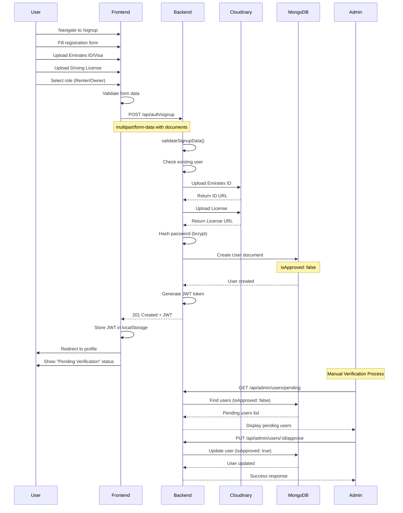
```mermaid
sequenceDiagram
    participant User
    participant Frontend
    participant Backend
    participant Cloudinary
    participant MongoDB
    participant Admin

    User->>Frontend: Navigate to /signup
    User->>Frontend: Fill registration form
    User->>Frontend: Upload Emirates ID/Visa
    User->>Frontend: Upload Driving License
    User->>Frontend: Select role (Renter/Owner)
    
    Frontend->>Frontend: Validate form data
    Frontend->>Backend: POST /api/auth/signup
    Note over Frontend,Backend: multipart/form-data with documents
    
    Backend->>Backend: validateSignupData()
    Backend->>Backend: Check existing user
    
    Backend->>Cloudinary: Upload Emirates ID
    Cloudinary-->>Backend: Return ID URL
    
    Backend->>Cloudinary: Upload License
    Cloudinary-->>Backend: Return License URL
    
    Backend->>Backend: Hash password (bcrypt)
    Backend->>MongoDB: Create User document
    Note over MongoDB: isApproved: false
    
    MongoDB-->>Backend: User created
    Backend->>Backend: Generate JWT token
    Backend-->>Frontend: 201 Created + JWT
    
    Frontend->>Frontend: Store JWT in localStorage
    Frontend->>User: Redirect to profile
    Frontend->>User: Show "Pending Verification" status
    
    Note over Admin: Manual Verification Process
    Admin->>Backend: GET /api/admin/users/pending
    Backend->>MongoDB: Find users (isApproved: false)
    MongoDB-->>Backend: Pending users list
    Backend-->>Admin: Display pending users
    
    Admin->>Backend: PUT /api/admin/users/:id/approve
    Backend->>MongoDB: Update user (isApproved: true)
    MongoDB-->>Backend: User updated
    Backend-->>Admin: Success response
```

### 7.2 Email Verification (OTP)

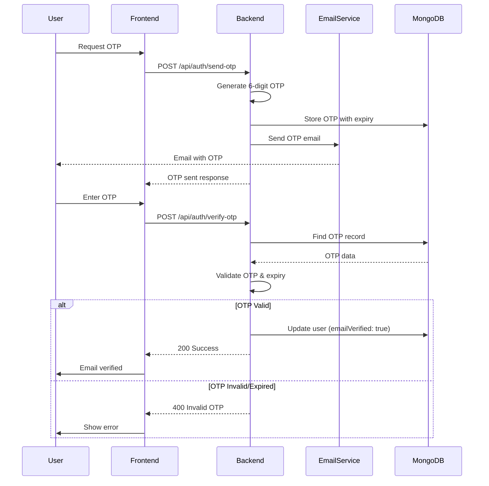
```mermaid
sequenceDiagram
    participant User
    participant Frontend
    participant Backend
    participant EmailService
    participant MongoDB

    User->>Frontend: Request OTP
    Frontend->>Backend: POST /api/auth/send-otp
    
    Backend->>Backend: Generate 6-digit OTP
    Backend->>MongoDB: Store OTP with expiry
    
    Backend->>EmailService: Send OTP email
    EmailService-->>User: Email with OTP
    
    Backend-->>Frontend: OTP sent response
    
    User->>Frontend: Enter OTP
    Frontend->>Backend: POST /api/auth/verify-otp
    
    Backend->>MongoDB: Find OTP record
    MongoDB-->>Backend: OTP data
    
    Backend->>Backend: Validate OTP & expiry
    
    alt OTP Valid
        Backend->>MongoDB: Update user (emailVerified: true)
        Backend-->>Frontend: 200 Success
        Frontend->>User: Email verified
    else OTP Invalid/Expired
        Backend-->>Frontend: 400 Invalid OTP
        Frontend->>User: Show error
    end
```

---

## 8. User Authentication (Login/Logout)

### 8.1 Login Flow

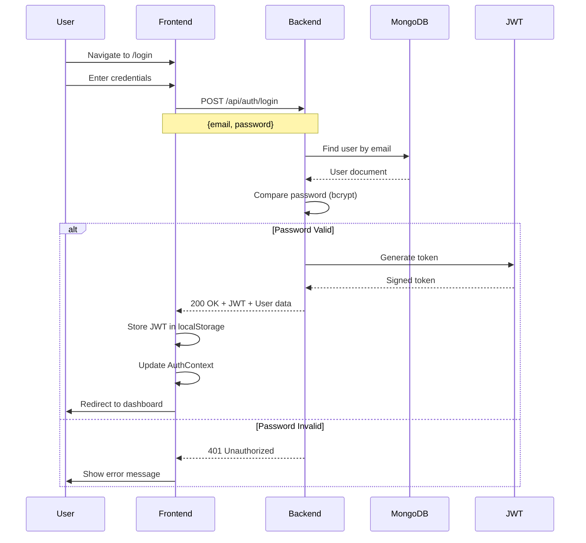
```mermaid
sequenceDiagram
    participant User
    participant Frontend
    participant Backend
    participant MongoDB
    participant JWT

    User->>Frontend: Navigate to /login
    User->>Frontend: Enter credentials
    
    Frontend->>Backend: POST /api/auth/login
    Note over Frontend,Backend: {email, password}
    
    Backend->>MongoDB: Find user by email
    MongoDB-->>Backend: User document
    
    Backend->>Backend: Compare password (bcrypt)
    
    alt Password Valid
        Backend->>JWT: Generate token
        JWT-->>Backend: Signed token
        
        Backend-->>Frontend: 200 OK + JWT + User data
        Frontend->>Frontend: Store JWT in localStorage
        Frontend->>Frontend: Update AuthContext
        Frontend->>User: Redirect to dashboard
    else Password Invalid
        Backend-->>Frontend: 401 Unauthorized
        Frontend->>User: Show error message
    end
```

### 8.2 Protected Route Access

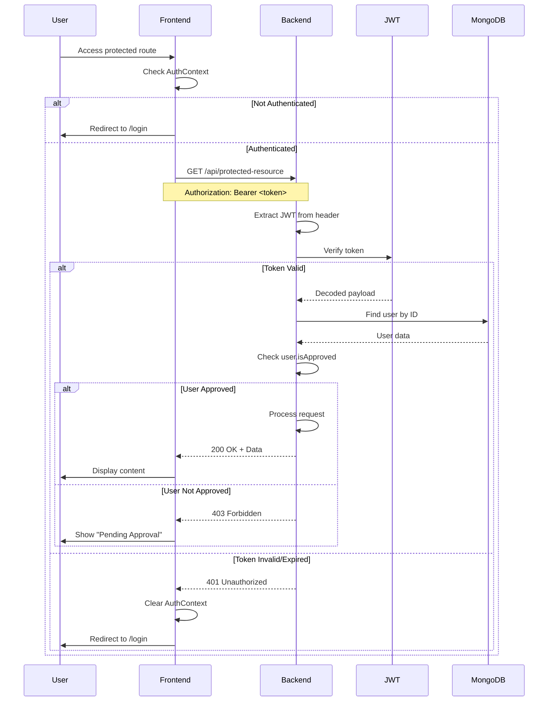
```mermaid
sequenceDiagram
    participant User
    participant Frontend
    participant Backend
    participant JWT
    participant MongoDB

    User->>Frontend: Access protected route
    Frontend->>Frontend: Check AuthContext
    
    alt Not Authenticated
        Frontend->>User: Redirect to /login
    else Authenticated
        Frontend->>Backend: GET /api/protected-resource
        Note over Frontend,Backend: Authorization: Bearer <token>
        
        Backend->>Backend: Extract JWT from header
        Backend->>JWT: Verify token
        
        alt Token Valid
            JWT-->>Backend: Decoded payload
            Backend->>MongoDB: Find user by ID
            MongoDB-->>Backend: User data
            
            Backend->>Backend: Check user.isApproved
            
            alt User Approved
                Backend->>Backend: Process request
                Backend-->>Frontend: 200 OK + Data
                Frontend->>User: Display content
            else User Not Approved
                Backend-->>Frontend: 403 Forbidden
                Frontend->>User: Show "Pending Approval"
            end
        else Token Invalid/Expired
            Backend-->>Frontend: 401 Unauthorized
            Frontend->>Frontend: Clear AuthContext
            Frontend->>User: Redirect to /login
        end
    end
```

---

## 9. Car Listing Creation

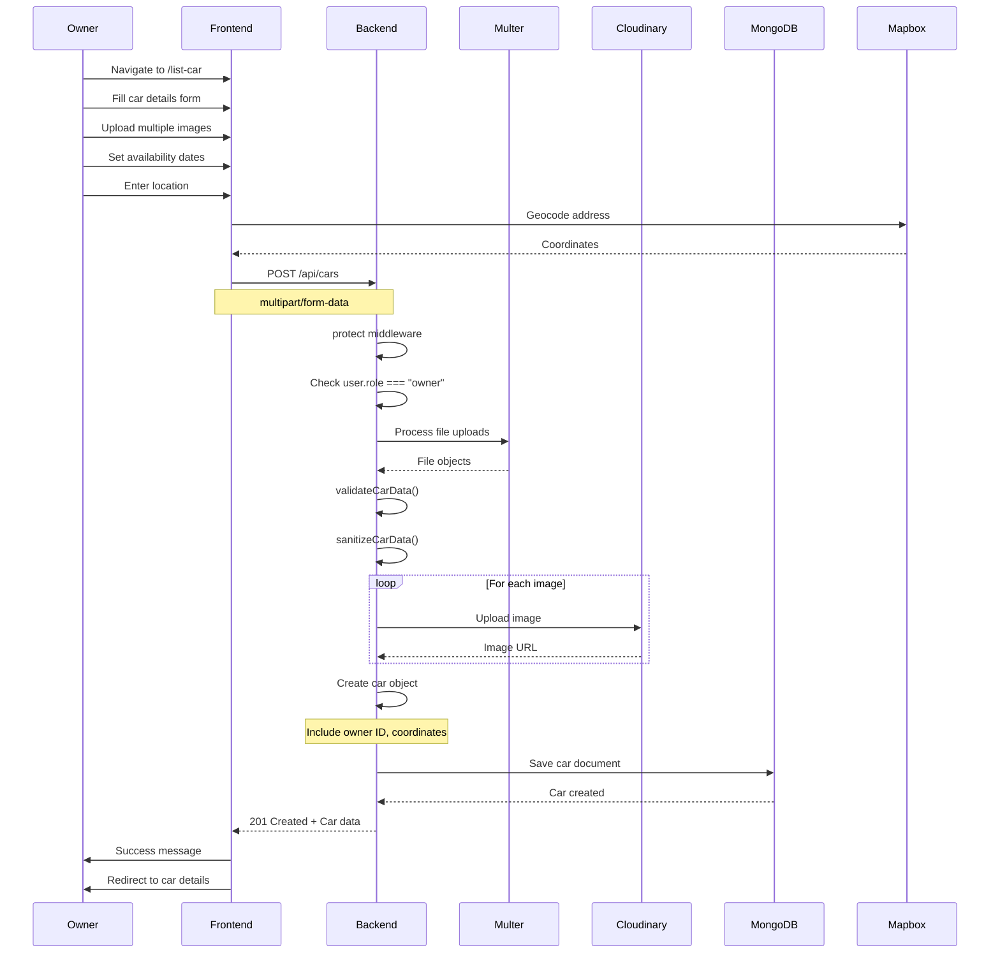
```mermaid
sequenceDiagram
    participant Owner
    participant Frontend
    participant Backend
    participant Multer
    participant Cloudinary
    participant MongoDB
    participant Mapbox

    Owner->>Frontend: Navigate to /list-car
    Owner->>Frontend: Fill car details form
    Owner->>Frontend: Upload multiple images
    Owner->>Frontend: Set availability dates
    Owner->>Frontend: Enter location
    
    Frontend->>Mapbox: Geocode address
    Mapbox-->>Frontend: Coordinates
    
    Frontend->>Backend: POST /api/cars
    Note over Frontend,Backend: multipart/form-data
    
    Backend->>Backend: protect middleware
    Backend->>Backend: Check user.role === "owner"
    
    Backend->>Multer: Process file uploads
    Multer-->>Backend: File objects
    
    Backend->>Backend: validateCarData()
    Backend->>Backend: sanitizeCarData()
    
    loop For each image
        Backend->>Cloudinary: Upload image
        Cloudinary-->>Backend: Image URL
    end
    
    Backend->>Backend: Create car object
    Note over Backend: Include owner ID, coordinates
    
    Backend->>MongoDB: Save car document
    MongoDB-->>Backend: Car created
    
    Backend-->>Frontend: 201 Created + Car data
    Frontend->>Owner: Success message
    Frontend->>Owner: Redirect to car details
```

---

## 10. Car Search & Filtering

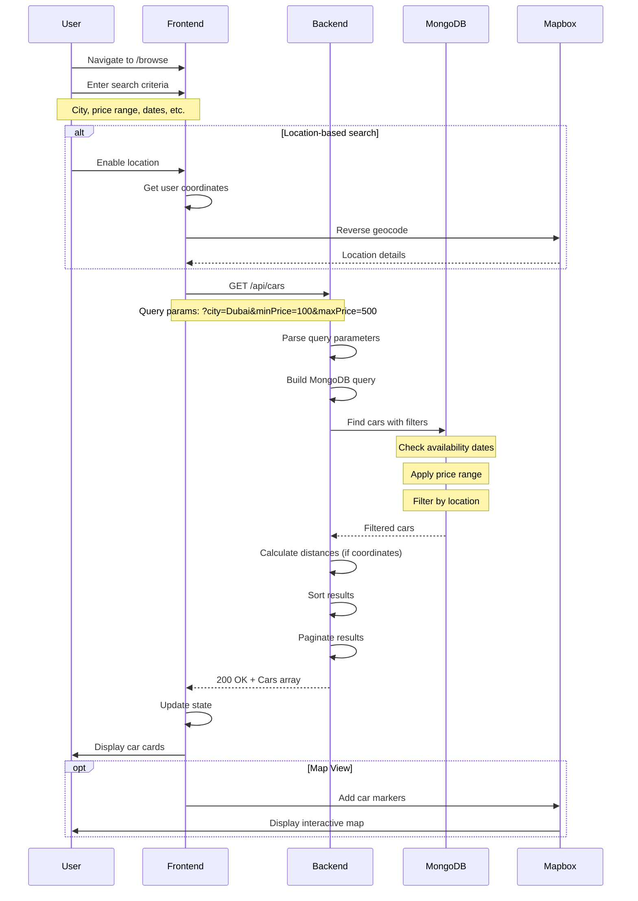
```mermaid
sequenceDiagram
    participant User
    participant Frontend
    participant Backend
    participant MongoDB
    participant Mapbox

    User->>Frontend: Navigate to /browse
    User->>Frontend: Enter search criteria
    Note over User,Frontend: City, price range, dates, etc.
    
    alt Location-based search
        User->>Frontend: Enable location
        Frontend->>Frontend: Get user coordinates
        Frontend->>Mapbox: Reverse geocode
        Mapbox-->>Frontend: Location details
    end
    
    Frontend->>Backend: GET /api/cars
    Note over Frontend,Backend: Query params: ?city=Dubai&minPrice=100&maxPrice=500
    
    Backend->>Backend: Parse query parameters
    Backend->>Backend: Build MongoDB query
    
    Backend->>MongoDB: Find cars with filters
    Note over MongoDB: Check availability dates
    Note over MongoDB: Apply price range
    Note over MongoDB: Filter by location
    
    MongoDB-->>Backend: Filtered cars
    
    Backend->>Backend: Calculate distances (if coordinates)
    Backend->>Backend: Sort results
    Backend->>Backend: Paginate results
    
    Backend-->>Frontend: 200 OK + Cars array
    
    Frontend->>Frontend: Update state
    Frontend->>User: Display car cards
    
    opt Map View
        Frontend->>Mapbox: Add car markers
        Mapbox->>User: Display interactive map
    end
```

---

## 11. Booking Creation

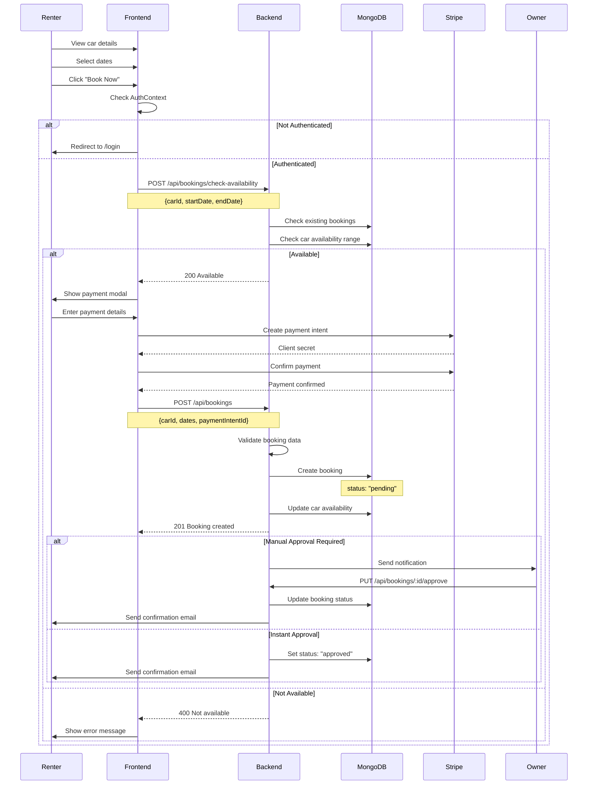
```mermaid
sequenceDiagram
    participant Renter
    participant Frontend
    participant Backend
    participant MongoDB
    participant Stripe
    participant Owner

    Renter->>Frontend: View car details
    Renter->>Frontend: Select dates
    Renter->>Frontend: Click "Book Now"
    
    Frontend->>Frontend: Check AuthContext
    
    alt Not Authenticated
        Frontend->>Renter: Redirect to /login
    else Authenticated
        Frontend->>Backend: POST /api/bookings/check-availability
        Note over Frontend,Backend: {carId, startDate, endDate}
        
        Backend->>MongoDB: Check existing bookings
        Backend->>MongoDB: Check car availability range
        
        alt Available
            Backend-->>Frontend: 200 Available
            Frontend->>Renter: Show payment modal
            
            Renter->>Frontend: Enter payment details
            Frontend->>Stripe: Create payment intent
            Stripe-->>Frontend: Client secret
            
            Frontend->>Stripe: Confirm payment
            Stripe-->>Frontend: Payment confirmed
            
            Frontend->>Backend: POST /api/bookings
            Note over Frontend,Backend: {carId, dates, paymentIntentId}
            
            Backend->>Backend: Validate booking data
            Backend->>MongoDB: Create booking
            Note over MongoDB: status: "pending"
            
            Backend->>MongoDB: Update car availability
            Backend-->>Frontend: 201 Booking created
            
            alt Manual Approval Required
                Backend->>Owner: Send notification
                Owner->>Backend: PUT /api/bookings/:id/approve
                Backend->>MongoDB: Update booking status
                Backend->>Renter: Send confirmation email
            else Instant Approval
                Backend->>MongoDB: Set status: "approved"
                Backend->>Renter: Send confirmation email
            end
            
        else Not Available
            Backend-->>Frontend: 400 Not available
            Frontend->>Renter: Show error message
        end
    end
```

---

## 12. Payment Processing

### 12.1 Payment Creation

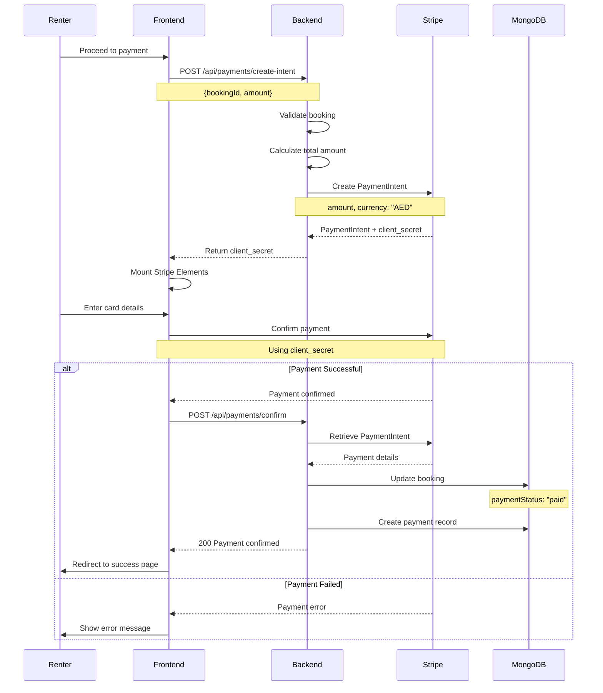
```mermaid
sequenceDiagram
    participant Renter
    participant Frontend
    participant Backend
    participant Stripe
    participant MongoDB

    Renter->>Frontend: Proceed to payment
    Frontend->>Backend: POST /api/payments/create-intent
    Note over Frontend,Backend: {bookingId, amount}
    
    Backend->>Backend: Validate booking
    Backend->>Backend: Calculate total amount
    
    Backend->>Stripe: Create PaymentIntent
    Note over Backend,Stripe: amount, currency: "AED"
    
    Stripe-->>Backend: PaymentIntent + client_secret
    Backend-->>Frontend: Return client_secret
    
    Frontend->>Frontend: Mount Stripe Elements
    Renter->>Frontend: Enter card details
    
    Frontend->>Stripe: Confirm payment
    Note over Frontend,Stripe: Using client_secret
    
    alt Payment Successful
        Stripe-->>Frontend: Payment confirmed
        Frontend->>Backend: POST /api/payments/confirm
        
        Backend->>Stripe: Retrieve PaymentIntent
        Stripe-->>Backend: Payment details
        
        Backend->>MongoDB: Update booking
        Note over MongoDB: paymentStatus: "paid"
        
        Backend->>MongoDB: Create payment record
        Backend-->>Frontend: 200 Payment confirmed
        
        Frontend->>Renter: Redirect to success page
    else Payment Failed
        Stripe-->>Frontend: Payment error
        Frontend->>Renter: Show error message
    end
```

### 12.2 Refund Processing

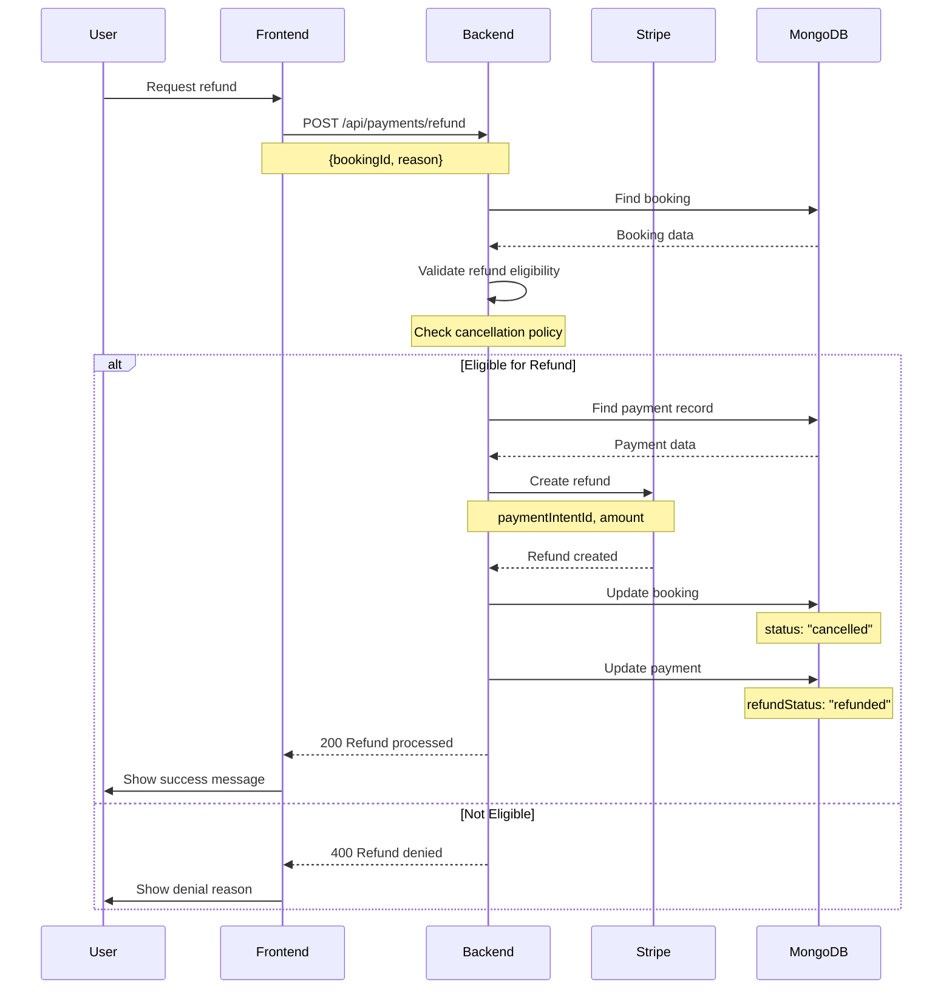
```mermaid
sequenceDiagram
    participant User
    participant Frontend
    participant Backend
    participant Stripe
    participant MongoDB

    User->>Frontend: Request refund
    Frontend->>Backend: POST /api/payments/refund
    Note over Frontend,Backend: {bookingId, reason}
    
    Backend->>MongoDB: Find booking
    MongoDB-->>Backend: Booking data
    
    Backend->>Backend: Validate refund eligibility
    Note over Backend: Check cancellation policy
    
    alt Eligible for Refund
        Backend->>MongoDB: Find payment record
        MongoDB-->>Backend: Payment data
        
        Backend->>Stripe: Create refund
        Note over Backend,Stripe: paymentIntentId, amount
        
        Stripe-->>Backend: Refund created
        
        Backend->>MongoDB: Update booking
        Note over MongoDB: status: "cancelled"
        
        Backend->>MongoDB: Update payment
        Note over MongoDB: refundStatus: "refunded"
        
        Backend-->>Frontend: 200 Refund processed
        Frontend->>User: Show success message
    else Not Eligible
        Backend-->>Frontend: 400 Refund denied
        Frontend->>User: Show denial reason
    end
```

---

## 13. Booking Management

### 13.1 Owner Booking Management

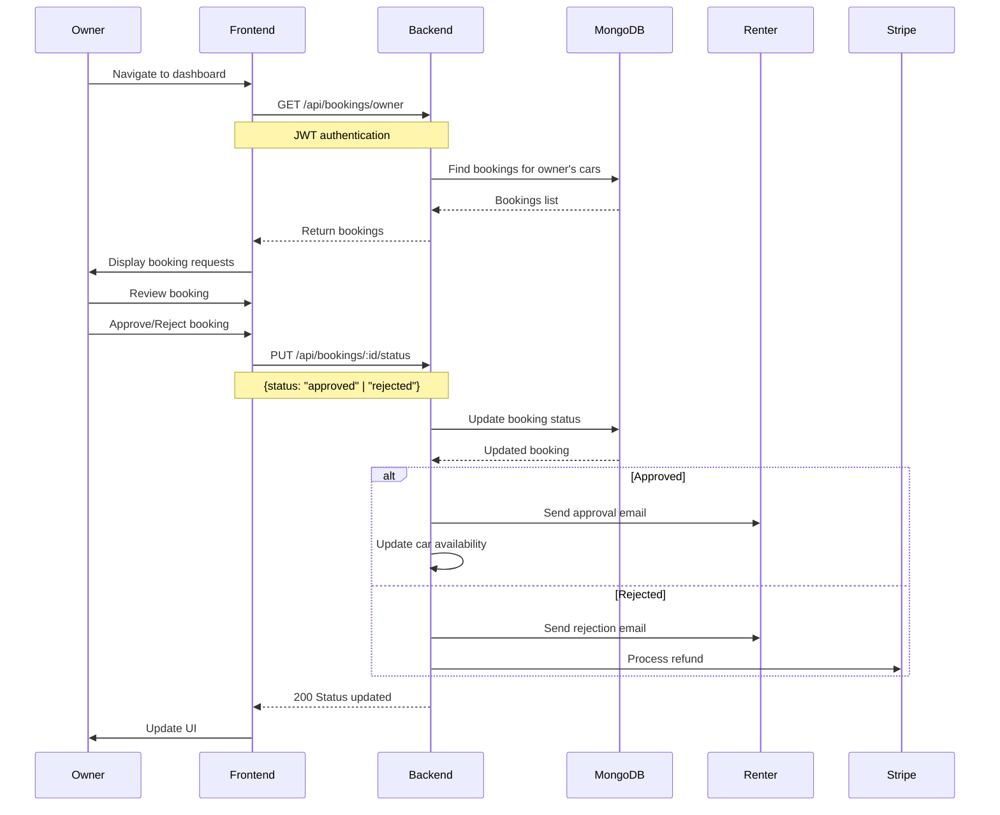
```mermaid
sequenceDiagram
    participant Owner
    participant Frontend
    participant Backend
    participant MongoDB
    participant Renter

    Owner->>Frontend: Navigate to dashboard
    Frontend->>Backend: GET /api/bookings/owner
    Note over Frontend,Backend: JWT authentication
    
    Backend->>MongoDB: Find bookings for owner's cars
    MongoDB-->>Backend: Bookings list
    
    Backend-->>Frontend: Return bookings
    Frontend->>Owner: Display booking requests
    
    Owner->>Frontend: Review booking
    Owner->>Frontend: Approve/Reject booking
    
    Frontend->>Backend: PUT /api/bookings/:id/status
    Note over Frontend,Backend: {status: "approved" | "rejected"}
    
    Backend->>MongoDB: Update booking status
    MongoDB-->>Backend: Updated booking
    
    alt Approved
        Backend->>Renter: Send approval email
        Backend->>Backend: Update car availability
    else Rejected
        Backend->>Renter: Send rejection email
        Backend->>Stripe: Process refund
    end
    
    Backend-->>Frontend: 200 Status updated
    Frontend->>Owner: Update UI
```

### 13.2 Renter Booking Management

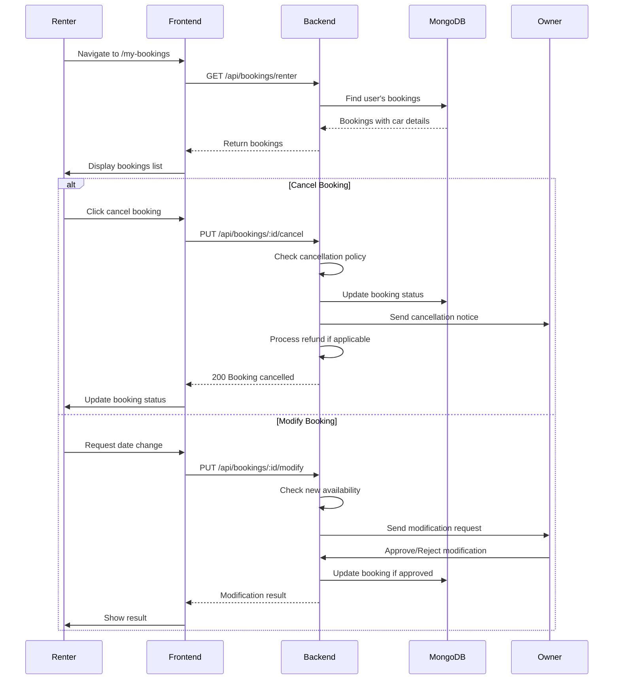
```mermaid
sequenceDiagram
    participant Renter
    participant Frontend
    participant Backend
    participant MongoDB
    participant Owner

    Renter->>Frontend: Navigate to /my-bookings
    Frontend->>Backend: GET /api/bookings/renter
    
    Backend->>MongoDB: Find user's bookings
    MongoDB-->>Backend: Bookings with car details
    
    Backend-->>Frontend: Return bookings
    Frontend->>Renter: Display bookings list
    
    alt Cancel Booking
        Renter->>Frontend: Click cancel booking
        Frontend->>Backend: PUT /api/bookings/:id/cancel
        
        Backend->>Backend: Check cancellation policy
        Backend->>MongoDB: Update booking status
        
        Backend->>Owner: Send cancellation notice
        Backend->>Backend: Process refund if applicable
        
        Backend-->>Frontend: 200 Booking cancelled
        Frontend->>Renter: Update booking status
    else Modify Booking
        Renter->>Frontend: Request date change
        Frontend->>Backend: PUT /api/bookings/:id/modify
        
        Backend->>Backend: Check new availability
        Backend->>Owner: Send modification request
        
        Owner->>Backend: Approve/Reject modification
        Backend->>MongoDB: Update booking if approved
        
        Backend-->>Frontend: Modification result
        Frontend->>Renter: Show result
    end
```

---

## 14. Admin Operations

### 14.1 User Verification

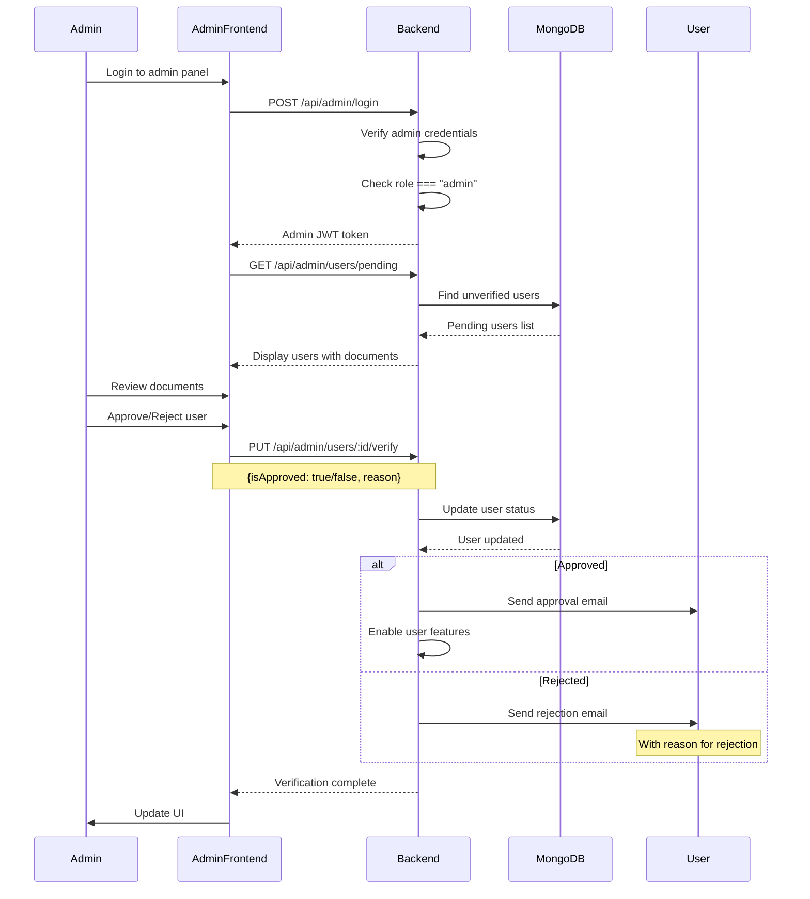
```mermaid
sequenceDiagram
    participant Admin
    participant AdminFrontend
    participant Backend
    participant MongoDB
    participant User

    Admin->>AdminFrontend: Login to admin panel
    AdminFrontend->>Backend: POST /api/admin/login
    
    Backend->>Backend: Verify admin credentials
    Backend->>Backend: Check role === "admin"
    Backend-->>AdminFrontend: Admin JWT token
    
    AdminFrontend->>Backend: GET /api/admin/users/pending
    Backend->>MongoDB: Find unverified users
    MongoDB-->>Backend: Pending users list
    
    Backend-->>AdminFrontend: Display users with documents
    
    Admin->>AdminFrontend: Review documents
    Admin->>AdminFrontend: Approve/Reject user
    
    AdminFrontend->>Backend: PUT /api/admin/users/:id/verify
    Note over AdminFrontend,Backend: {isApproved: true/false, reason}
    
    Backend->>MongoDB: Update user status
    MongoDB-->>Backend: User updated
    
    alt Approved
        Backend->>User: Send approval email
        Backend->>Backend: Enable user features
    else Rejected
        Backend->>User: Send rejection email
        Note over User: With reason for rejection
    end
    
    Backend-->>AdminFrontend: Verification complete
    AdminFrontend->>Admin: Update UI
```

### 14.2 Content Moderation

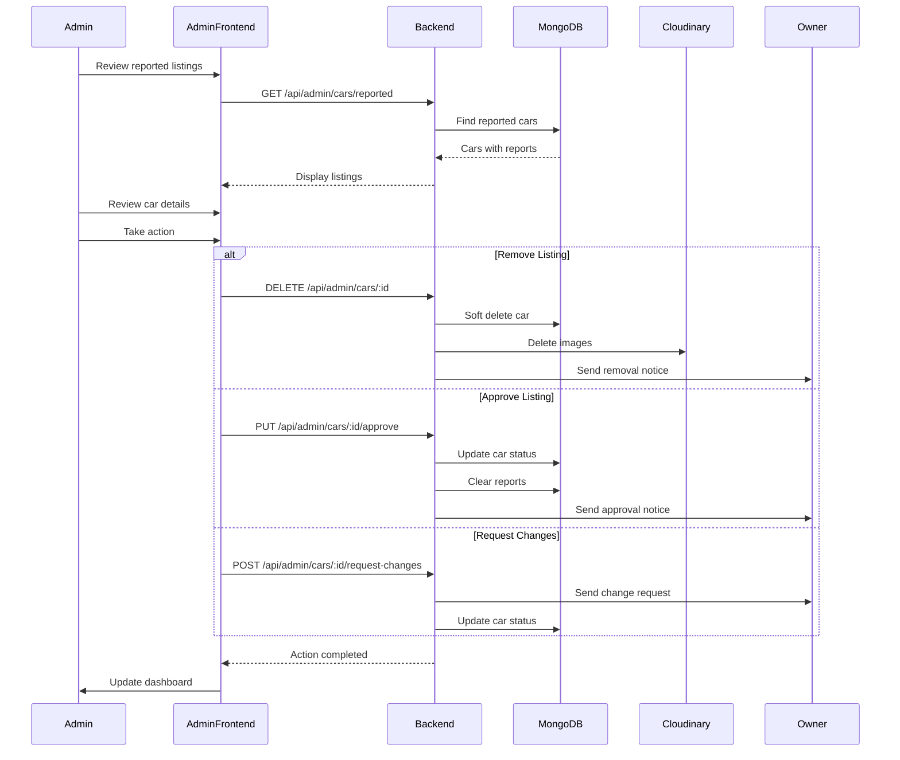
```mermaid
sequenceDiagram
    participant Admin
    participant AdminFrontend
    participant Backend
    participant MongoDB
    participant Cloudinary
    participant Owner

    Admin->>AdminFrontend: Review reported listings
    AdminFrontend->>Backend: GET /api/admin/cars/reported
    
    Backend->>MongoDB: Find reported cars
    MongoDB-->>Backend: Cars with reports
    
    Backend-->>AdminFrontend: Display listings
    
    Admin->>AdminFrontend: Review car details
    Admin->>AdminFrontend: Take action
    
    alt Remove Listing
        AdminFrontend->>Backend: DELETE /api/admin/cars/:id
        Backend->>MongoDB: Soft delete car
        Backend->>Cloudinary: Delete images
        Backend->>Owner: Send removal notice
    else Approve Listing
        AdminFrontend->>Backend: PUT /api/admin/cars/:id/approve
        Backend->>MongoDB: Update car status
        Backend->>MongoDB: Clear reports
        Backend->>Owner: Send approval notice
    else Request Changes
        AdminFrontend->>Backend: POST /api/admin/cars/:id/request-changes
        Backend->>Owner: Send change request
        Backend->>MongoDB: Update car status
    end
    
    Backend-->>AdminFrontend: Action completed
    AdminFrontend->>Admin: Update dashboard
```

---

## Additional Sequence Diagrams

### Location-Based Car Search

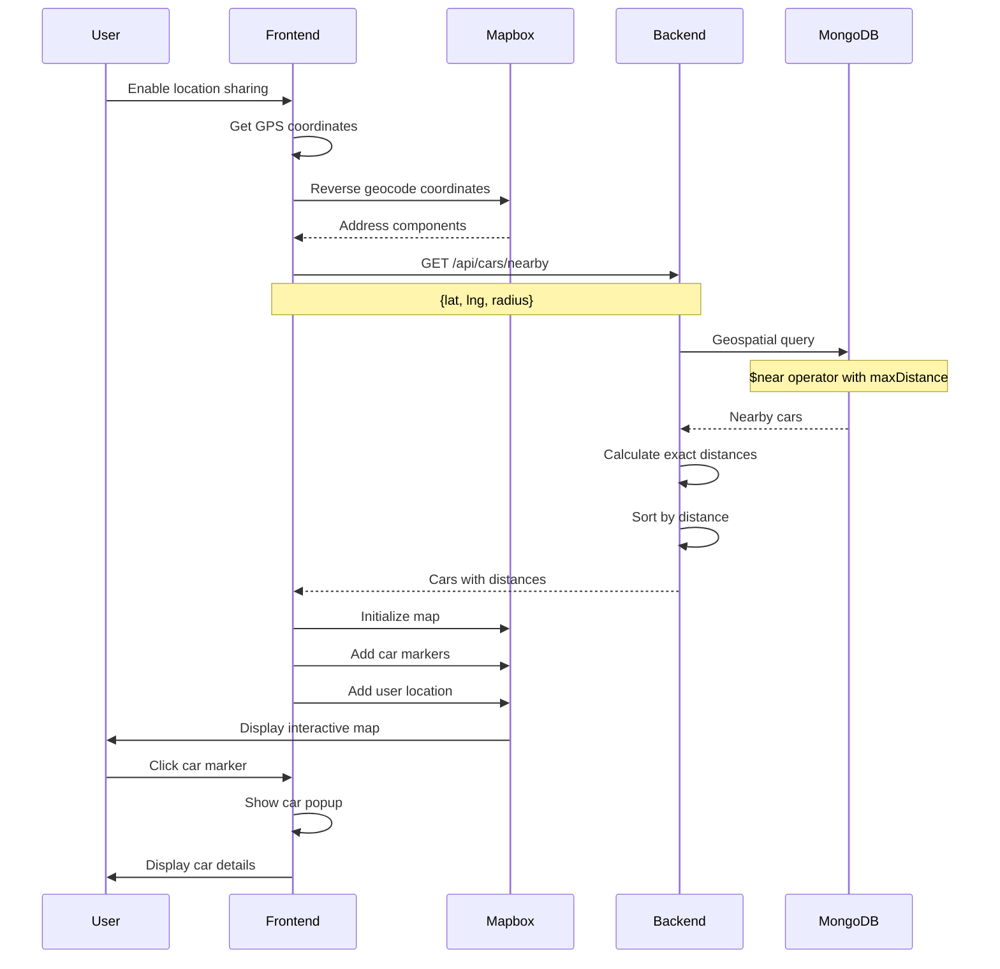
```mermaid
sequenceDiagram
    participant User
    participant Frontend
    participant Mapbox
    participant Backend
    participant MongoDB

    User->>Frontend: Enable location sharing
    Frontend->>Frontend: Get GPS coordinates
    
    Frontend->>Mapbox: Reverse geocode coordinates
    Mapbox-->>Frontend: Address components
    
    Frontend->>Backend: GET /api/cars/nearby
    Note over Frontend,Backend: {lat, lng, radius}
    
    Backend->>MongoDB: Geospatial query
    Note over MongoDB: $near operator with maxDistance
    
    MongoDB-->>Backend: Nearby cars
    
    Backend->>Backend: Calculate exact distances
    Backend->>Backend: Sort by distance
    
    Backend-->>Frontend: Cars with distances
    
    Frontend->>Mapbox: Initialize map
    Frontend->>Mapbox: Add car markers
    Frontend->>Mapbox: Add user location
    
    Mapbox->>User: Display interactive map
    
    User->>Frontend: Click car marker
    Frontend->>Frontend: Show car popup
    Frontend->>User: Display car details
```

### Profile Picture Upload

```mermaid
sequenceDiagram
    participant User
    participant Frontend
    participant Backend
    participant Multer
    participant Cloudinary
    participant MongoDB

    User->>Frontend: Navigate to profile
    User->>Frontend: Click change avatar
    User->>Frontend: Select image file
    
    Frontend->>Frontend: Preview image
    Frontend->>Frontend: Validate file type/size
    
    Frontend->>Backend: POST /api/users/profile-picture
    Note over Frontend,Backend: multipart/form-data
    
    Backend->>Multer: Process upload
    Multer-->>Backend: File object
    
    Backend->>Backend: Validate image
    
    Backend->>Cloudinary: Upload to user folder
    Cloudinary-->>Backend: Image URL
    
    Backend->>MongoDB: Find old picture URL
    MongoDB-->>Backend: Previous URL
    
    Backend->>Cloudinary: Delete old image
    
    Backend->>MongoDB: Update user.profilePicture
    MongoDB-->>Backend: User updated
    
    Backend-->>Frontend: 200 OK + new URL
    Frontend->>Frontend: Update avatar display
    Frontend->>User: Show success message
```

---

## Error Handling Patterns

### Generic Error Flow

```mermaid
sequenceDiagram
    participant User
    participant Frontend
    participant Backend
    participant ErrorHandler

    User->>Frontend: Trigger action
    Frontend->>Backend: API Request
    
    Backend->>Backend: Process request
    
    alt Error Occurs
        Backend->>ErrorHandler: Throw AppError
        ErrorHandler->>ErrorHandler: Determine error type
        
        alt Validation Error
            ErrorHandler-->>Frontend: 400 Bad Request
            Note over ErrorHandler,Frontend: Field-specific errors
        else Authentication Error
            ErrorHandler-->>Frontend: 401 Unauthorized
            Frontend->>Frontend: Clear auth state
            Frontend->>User: Redirect to login
        else Authorization Error
            ErrorHandler-->>Frontend: 403 Forbidden
            Frontend->>User: Show permission error
        else Not Found Error
            ErrorHandler-->>Frontend: 404 Not Found
            Frontend->>User: Show not found message
        else Server Error
            ErrorHandler-->>Frontend: 500 Internal Server
            Frontend->>User: Show generic error
        end
    else Success
        Backend-->>Frontend: 2xx Success
        Frontend->>User: Show success state
    end
```

---

## WebSocket Events (Future Implementation)

### Real-time Booking Updates

```mermaid
sequenceDiagram
    participant Renter
    participant Owner
    participant WebSocket
    participant Backend
    participant MongoDB

    Note over Renter,Owner: Both connected via WebSocket
    
    Renter->>Backend: Create booking
    Backend->>MongoDB: Save booking
    
    Backend->>WebSocket: Emit "new-booking"
    WebSocket->>Owner: Notify new booking
    
    Owner->>Backend: Approve booking
    Backend->>MongoDB: Update status
    
    Backend->>WebSocket: Emit "booking-approved"
    WebSocket->>Renter: Notify approval
    
    Note over Renter,Owner: Real-time updates without refresh
```

---

## Notes

1. All API endpoints require proper error handling and validation
2. JWT tokens expire after 7 days by default
3. File uploads are limited to 10MB per file
4. Cloudinary automatically optimizes images
5. All monetary amounts are in AED (UAE Dirhams)
6. Dates are stored in UTC and converted to local time in frontend
7. Phone numbers are validated for UAE format
8. Geospatial queries use MongoDB's 2dsphere index
